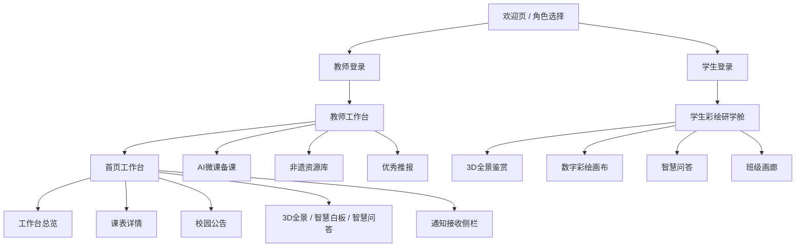

# 青墙粉绘 · 前端高保真原型展示

> **大理白族民居彩绘美育系统** — 人机交互设计课程可交互原型  
> 技术栈：React 19 + Vite + Express + Tailwind CSS 4（Nupul 触觉风）

---

## 1. 如何打开原型

在项目根目录执行：

```bash
npm install
npm run dev
```

浏览器访问：**http://localhost:3000**

（当前开发服务默认端口 `3000`，由 `server.ts` 统一托管前后端。）

**测试清单与分路径验收**见 → [`docs/前端测试界面.md`](./前端测试界面.md)

---

## 2. 演示账号与入口

| 角色 | 入口 | 登录方式 |
|------|------|----------|
| 教师 | 首页 →「授课登录 · 智能备课台」 | 工号 `SL-1008`，密码 `demo123`（密码可留空） |
| 学生 | 首页 →「学生登录 · 开启传统美育」 | 填写姓名（如 `杨一诺`）+ 选择班级 →「进入研学舱」 |

登录后顶部可 **切换教师端 / 学生端** 或 **返回主页**。

---

## 3. 信息架构（IA）



---

## 4. 核心界面说明

### 4.1 欢迎页（角色网关）

- 品牌区：「壁画青墙 · 粉绘非遗研学舱」
- 双栏能力介绍：教师工作台 / 研学体验营
- 黄绿渐变背景 + 粗棕边框卡片（品牌色卡：`#28B06E` / `#FFC526` / `#3B2E0B`）

### 4.2 教师工作台

| 模块 | 功能要点 |
|------|----------|
| 顶栏 | 当前教师身份、示范片区、端切换 |
| 主导航 | 首页工作台、AI微课备课、非遗资源库、优秀推报 |
| 工作台总览 | 学生覆盖、画廊作品、完成率等指标 |
| 互动工具条 | 3D全景鉴赏、智慧白板、智慧问答（横向三卡） |
| 今日课表 | 时间轴 + 三节授课卡片（进行中 / 待开始状态） |
| 校园通知 | 右侧紧凑列表 +「通知接收」未读角标与侧栏详情 |

**子页面深化**：各 Tab 下接 `SubPageNav` + `TeacherDeepPanels`（课表、公告、备课、资源等二级面板）。

### 4.3 学生彩绘研学舱

| Tab | 功能要点 |
|-----|----------|
| 3D全景鉴赏 | 热点漫游、非遗场景讲解 |
| 数字彩绘 | 线稿填色、大师配色、作品导出 PNG |
| 智慧问答 | AI 助教「小茶」非遗知识问答 |
| 班级画廊 | 同学作品墙、自豪感日记类展示 |

**子页面深化**：`StudentDeepPanels` 提供纹样、配色、伴读等扩展内容。

---

## 5. 设计规范摘要

详见 `docs/DESIGN_SYSTEM.md` 与 `src/design-system/tokens.css`。

| 角色 | 色值 | 用途 |
|------|------|------|
| 主题绿 | `#28B06E` | 主按钮、进行中状态、标签 |
| 主题黄 | `#FFC526` | 高亮、主操作、分类标签 |
| 强调橙 | `#FBA303` | 未读、警示、CTA |
| 深棕 | `#3B2E0B` | 正文、粗边框 |
| 浅绿 / 浅黄 | `#8BC48F` / `#FFF0C8` | 柔和背景 |

字体：**苹方 PingFang SC**；排版类名 `text-display-*` / `text-body` / `text-caption`。

---

## 6. 原型演示建议路径（5 分钟）

1. **欢迎页** → 介绍双角色定位（30s）
2. **教师登录** → 工作台总览 + 三工具卡（1min）
3. **课表 + 通知** → 点击「通知接收」打开侧栏（1min）
4. **切换学生端** → 3D 漫游或彩绘画布（1.5min）
5. **班级画廊** → 作品展示与署名（1min）

---

## 7. 文件索引（前端）

| 路径 | 说明 |
|------|------|
| `src/App.tsx` | 路由状态、数据引导 |
| `src/components/RoleSelection.tsx` | 欢迎页与登录 |
| `src/components/TeacherPortal.tsx` | 教师工作台主界面 |
| `src/components/StudentPortal.tsx` | 学生研学舱 |
| `src/components/teacher/NoticesInbox.tsx` | 通知侧栏 |
| `src/components/shared/SubPageNav.tsx` | 三级子页导航 |
| `src/index.css` | 全局样式与 Nupul 组件类 |

---

## 8. 在线预览

开发服务运行后，在 Cursor 侧栏浏览器或系统浏览器打开：

**http://localhost:3000**

即为当前可交互高保真原型，无需额外静态导出。
